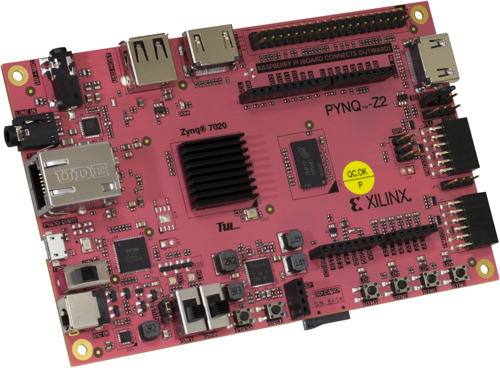

# AFSK Demodulator on PYNQ

This is a series of notebooks on migrating an [AFSK demodulator we developed in Python](https://github.com/mobilinkd/afsk-demodulator/blob/master/afsk-demodulator.ipynb) to FPGA on PYNQ.

Start [here](afsk-demodulator-fpga.ipynb).

The project will use Vivado running on a laptop/desktop/workstation and a Pynq FPGA SOC development board.

This repository is designed to be checked out on both the workstation running Vivado and the Pynq boards.

